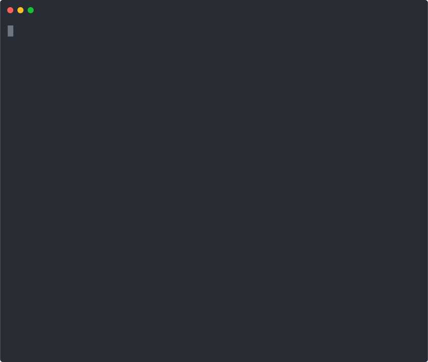

# cargo-kimi

[](https://crates.io/crates/cargo-kimi)
[](https://github.com/ekhodzitsky/cargo-kimi/actions)
[](LICENSE)

Cargo subcommand for [kimi-guidelines](https://github.com/ekhodzitsky/kimi-guidelines) — structured contracts for Rust.

> **Making AI-generated code reviewable by humans in 30 seconds.**



`cargo-kimi` scores every Rust file 0–100 on contract quality: Hoare triples, panic safety, newtypes, typestate, and function length. It auto-fixes mechanical issues and tracks improvement over time.

---

## Installation

```bash
cargo install cargo-kimi
```

Or from source:

```bash
cargo install --git https://github.com/ekhodzitsky/cargo-kimi cargo-kimi
```

---

## 30-Second Demo

```bash
$ cargo kimi init --template rust-only --yes
$ cargo kimi check

=== Running contract checker (strictness: standard) ===

src/main.rs (score: 85)
  [MAJOR] L42: pub fn 'parse_config' missing Hoare triple doc comment
  [CRITICAL] L67: unwrap()/expect()/panic!() found outside tests: let port = env::var("PORT").unwrap();

src/lib.rs (score: 100)

Found 2 issues (CRITICAL: 1, MAJOR: 1, MINOR: 0, INFO: 0)
Average score: 92/100

=== Running cargo clippy ===
    Finished dev [unoptimized + debuginfo] target(s) in 0.42s

=== Running cargo test ===
    Running unittests src/lib.rs
    test result: ok. 14 passed

✅ All checks passed
```

---

## Commands

### `cargo kimi init`

Initialize AI coding guidelines in the current project.

```bash
cargo kimi init --template rust-only --strictness strict --yes
```

**Templates:**
- `minimal` — Core rules only (`AGENTS.md`)
- `rust-only` — Core rules + Rust-specific lints (default)
- `full` — Core rules + Rust + CI + benchmarks
- `modular` — Split rules into `.kimi/parts/` directory for large projects

### `cargo kimi check`

Run mechanized checks and compute a 0–100 contract score.

```bash
cargo kimi check                   # Standard strictness + clippy + tests
cargo kimi check --strictness strict
cargo kimi check --format json     # Pure JSON output for CI (no clippy/test)
cargo kimi check --format sarif    # SARIF for GitHub Code Scanning
```

Scoring breakdown:
- Hoare triples on `pub fn` — 30 pts
- No `unwrap`/`expect`/`panic` — 20 pts
- Newtype wrappers — 10 pts
- `PhantomData` usage — 10 pts
- Typestate patterns — 10 pts
- Average function length ≤ 40 lines — 10 pts
- Proper `Result` handling — 10 pts

**Score exemptions:** Add `// kimi:score-ignore=unwrap,unsafe` in the first 10 lines of a file to waive specific penalties (issues are still reported with `[EXEMPT]`). Useful for FFI boundaries and generated code.

### `cargo kimi fix`

Auto-fix mechanical issues: insert Hoare triple stubs, replace `unwrap()` with `?`,
and add `// SAFETY:` comments before `unsafe` blocks.

```bash
cargo kimi fix --dry-run           # Preview changes
cargo kimi fix                     # Apply fixes
```

**What it does:**
- Adds `/// { precondition }` / `/// { postcondition }` doc comments above `pub fn`
- Replaces `.unwrap()` → `?` where the return type allows it
- Replaces `.expect("msg")` → `.map_err(|e| format!("msg: {e}"))?`
- Adds `// SAFETY: TODO: explain why this is safe` before `unsafe` blocks

### `cargo kimi watch`

Watch source files and re-run checks on every save.

```bash
cargo kimi watch                   # Text output, 500ms debounce
cargo kimi watch --format json     # JSON output for editor integration
cargo kimi watch --debounce-ms 200 # Faster feedback
```

### `cargo kimi trend`

Show score history as an ASCII bar chart.

```bash
cargo kimi trend --days 30
```

Scores are appended to `.kimi/score-history.jsonl` after every `cargo kimi check`.

### `cargo kimi badge`

Generate an SVG score badge for your README.

```bash
cargo kimi badge                   # writes kimi-score.svg
cargo kimi badge --output assets/badge.svg
```

### `cargo kimi verify`

Run formal verification with Kani (requires `kani-verifier`).

```bash
cargo kimi verify
```

### `cargo kimi init-skill`

Generate a `SKILL.md` with YAML frontmatter compatible with agent skills.

```bash
cargo kimi init-skill my-skill "Description of what this skill does"
```

### `cargo kimi mcp`

Start an MCP server over stdio for Claude Code, Codex, and other MCP clients.

```bash
cargo kimi mcp
```

Exposes the `check_contracts` tool natively — no shell execution required.

### `cargo kimi lsp`

Start an LSP server for real-time diagnostics and code actions in any editor.

```bash
cargo kimi lsp
```

**Features:**
- **Diagnostics** — contract issues inline while you type (with debounce on save)
- **Code Actions** — quick fixes: "Insert Hoare triple", "Add SAFETY comment"
- **Hover** — file score and issue count on hover

**Neovim example (via lspconfig):**

```lua
require('lspconfig').cargo_kimi.setup {
  cmd = { 'cargo', 'kimi', 'lsp' },
  filetypes = { 'rust' },
  root_dir = require('lspconfig.util').root_pattern('Cargo.toml'),
}
```

**VS Code:** Use the generic LSP client extension (e.g., `generic-lsp`) pointed at `cargo kimi lsp`.

---

## Configuration

Create `.kimi.toml` (or `kimi.toml`) in your project root:

```toml
[contracts]
strictness = "standard"
fail-on-drop = 60

[score]
ignore = ["tests/", "benches/"]

[output]
format = "rich"
```

When present, `cargo kimi` automatically reads these values as defaults for `check`, `watch`, and `badge`.

## Strictness Levels

- `relaxed` — Only critical violations fail
- `standard` — Critical + major (default)
- `strict` — All violations including minor and info

---

## GitHub Action

Add contract checking to your CI with automatic PR comments:

```yaml
# .github/workflows/kimi.yml
name: Kimi Contract Check

on:
  pull_request:
    paths:
      - '**.rs'
      - 'Cargo.toml'

jobs:
  contracts:
    runs-on: ubuntu-latest
    permissions:
      pull-requests: write
    steps:
      - uses: actions/checkout@v4
      - uses: ekhodzitsky/cargo-kimi/.github/actions/cargo-kimi@main
        with:
          strictness: standard
          fail-on-drop: 60
          post-comment: true
```

**Inputs:**

| Input | Default | Description |
|-------|---------|-------------|
| `strictness` | `standard` | Contract strictness level |
| `fail-on-drop` | `0` | Fail CI if score drops below threshold (0 = off) |
| `post-comment` | `true` | Post PR comment with results |

---

## Example Workflow

```bash
# Initialize a Rust project with strict rules
cargo kimi init --template rust-only --strictness strict --yes

# Check current score
cargo kimi check

# Preview auto-fixes
cargo kimi fix --dry-run

# Apply mechanical fixes
cargo kimi fix

# Re-check after fixes
cargo kimi check

# Watch for changes during development
cargo kimi watch

# View score trend over time
cargo kimi trend --days 14
```

---

## Development

```bash
git clone https://github.com/ekhodzitsky/cargo-kimi.git
cd cargo-kimi
cargo test
cargo clippy -- -D warnings
cargo audit
cargo deny check
```

---

## License

MIT
