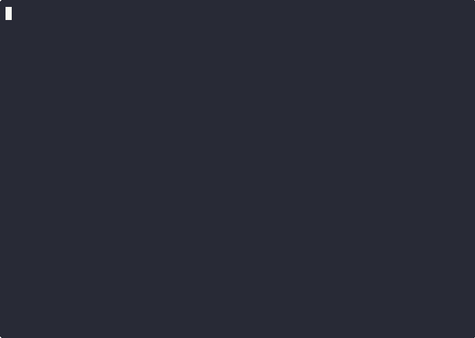

# cargo-kimi

[](https://crates.io/crates/cargo-kimi)
[](https://docs.rs/cargo-kimi)
[](https://github.com/ekhodzitsky/cargo-kimi/actions)
[](LICENSE)
[](https://rustup.rs)

> **Mechanized contracts for Rust. Make AI-generated code reviewable by humans in 30 seconds.**

`cargo-kimi` is a [cargo subcommand](https://doc.rust-lang.org/cargo/reference/external-tools.html#custom-subcommands) that scores every Rust file **0–100** on contract quality:

- **Hoare triples** — every `pub fn` documents pre- and post-conditions
- **Panic safety** — no `unwrap` / `expect` / `panic!` outside tests
- **Type discipline** — newtypes, `PhantomData`, typestate patterns
- **Size discipline** — average function length ≤ 40 lines
- **Error handling** — `Result` propagation instead of silent crashes

It auto-fixes mechanical issues, tracks improvement over time, and exposes an **LSP server** for real-time editor feedback.



---

## Table of Contents

- [Installation](#installation)
- [Quick Start](#quick-start)
- [Commands](#commands)
- [Scoring System](#scoring-system)
- [Editor Integration (LSP)](#editor-integration-lsp)
- [GitHub Action](#github-action)
- [Configuration](#configuration)
- [FAQ](#faq)
- [Development](#development)
- [License](#license)

---

## Installation

**From crates.io** (recommended):

```bash
cargo install cargo-kimi
```

**From source:**

```bash
cargo install --git https://github.com/ekhodzitsky/cargo-kimi cargo-kimi
```

**Requirements:**
- Rust **1.80+**
- `cargo` in `$PATH`

---

## Quick Start

```bash
# 1. Initialize guidelines in your Rust project
cargo kimi init --template rust-only --yes

# 2. Check contract score
cargo kimi check

# 3. Preview auto-fixes
cargo kimi fix --dry-run

# 4. Apply mechanical fixes
cargo kimi fix

# 5. Watch for changes during development
cargo kimi watch
```

**Example output:**

```text
=== Running contract checker (strictness: standard) ===

src/main.rs (score: 85)
  🔴 [CRITICAL] L67: unwrap()/expect()/panic!() found outside tests: let port = env::var("PORT").unwrap();
  🟠 [MAJOR]    L42: pub fn 'parse_config' missing Hoare triple doc comment

src/lib.rs (score: 100)

Average score: 92/100
```

---

## Commands

| Command | What it does |
|---------|--------------|
| `cargo kimi init` | Write `AGENTS.md` + `.cargo/config.toml` (clippy lints) |
| `cargo kimi check` | Run contract checker + `cargo clippy` + `cargo test` |
| `cargo kimi fix` | Auto-insert Hoare triples, replace `unwrap()` with `?`, add `// SAFETY:` |
| `cargo kimi watch` | Watch `src/` and re-run checks on every save |
| `cargo kimi trend` | Show ASCII bar chart of score history |
| `cargo kimi badge` | Generate `kimi-score.svg` for your README |
| `cargo kimi verify` | Run `cargo kani` formal verification (requires `kani-verifier`) |
| `cargo kimi lsp` | Start LSP server for real-time diagnostics |
| `cargo kimi mcp` | Start MCP server for Claude Code / Codex integration |
| `cargo kimi init-skill` | Generate a `SKILL.md` template |

### `cargo kimi check`

```bash
cargo kimi check                          # text + clippy + tests
cargo kimi check --strictness strict      # stricter rules
cargo kimi check --format json            # pure JSON (no clippy/test)
cargo kimi check --format sarif           # SARIF for GitHub Code Scanning
```

### `cargo kimi fix`

```bash
cargo kimi fix --dry-run                  # preview changes
cargo kimi fix                            # apply fixes
```

**Transformations:**
- `pub fn foo()` → inserts `/// { TODO: precondition }` / `/// { TODO: postcondition }`
- `.unwrap()` → `?` (when return type is `Result` / `Option`)
- `.expect("msg")` → `.map_err(|e| format!("msg: {e}"))?`
- `unsafe { ... }` → inserts `// SAFETY: TODO: explain why this is safe`

### `cargo kimi watch`

```bash
cargo kimi watch --debounce-ms 200        # faster feedback
cargo kimi watch --format json            # JSON for editor integration
```

---

## Scoring System

Score is computed per-file (0–100) and averaged across the project:

| Criterion | Weight | How to satisfy |
|-----------|--------|----------------|
| Hoare triples on `pub fn` | 30 pts | Add `/// { precondition }` / `/// { postcondition }` doc comments |
| No `unwrap` / `expect` / `panic!` | 20 pts | Use `?`, `ok_or`, `map_err` |
| Newtype wrappers | 10 pts | `pub struct Foo(Bar)` for domain types |
| `PhantomData` usage | 10 pts | Use `std::marker::PhantomData` where appropriate |
| Typestate patterns | 10 pts | `enum` + `impl` + `From<...>` |
| Avg function length ≤ 40 lines | 10 pts | Extract helper functions |
| `Result<...>` return types | 10 pts | Propagate errors instead of unwrapping |

**Exemptions:** Add `// kimi:score-ignore=unwrap,unsafe` in the first 10 lines of a file to waive specific penalties. Issues are still reported as `[EXEMPT]`.

---

## Editor Integration (LSP)

```bash
cargo kimi lsp
```

**Features:**
- **Diagnostics** — squiggles for contract violations while you type
- **Code Actions** — ⌘+. / Ctrl+. → "Insert Hoare triple", "Add SAFETY comment"
- **Hover** — file score and issue count on hover

**Neovim** (`lspconfig`):

```lua
require('lspconfig').cargo_kimi.setup {
  cmd = { 'cargo', 'kimi', 'lsp' },
  filetypes = { 'rust' },
  root_dir = require('lspconfig.util').root_pattern('Cargo.toml'),
}
```

**VS Code:** Use any generic LSP client extension pointed at `cargo kimi lsp`.

---

## GitHub Action

Add contract checking to your CI:

```yaml
# .github/workflows/kimi.yml
name: Kimi Contract Check

on:
  pull_request:
    paths:
      - '**.rs'
      - 'Cargo.toml'

jobs:
  contracts:
    runs-on: ubuntu-latest
    permissions:
      pull-requests: write
    steps:
      - uses: actions/checkout@11bd71901bbe5b1630ceea73d27597364c9af683 # v4
      - uses: ekhodzitsky/cargo-kimi/.github/actions/cargo-kimi@main
        with:
          strictness: standard
          fail-on-drop: 60
          post-comment: true
```

**Inputs:**

| Input | Default | Description |
|-------|---------|-------------|
| `strictness` | `standard` | Contract strictness level |
| `fail-on-drop` | `0` | Fail CI if score drops below threshold (0 = off) |
| `post-comment` | `true` | Post PR comment with results |

---

## Configuration

Create `.kimi.toml` (or `kimi.toml`) in your project root:

```toml
[contracts]
strictness = "standard"
fail-on-drop = 60

[score]
ignore = ["tests/", "benches/"]

[output]
format = "rich"
```

When present, `cargo-kimi` reads these values as defaults for `check`, `watch`, and `badge`.

### Strictness Levels

| Level | Fails on |
|-------|----------|
| `relaxed` | Critical issues only |
| `standard` | Critical + Major (default) |
| `strict` | Critical + Major + Minor + Info |

---

## FAQ

**Q: Will `cargo-kimi` break my build?**  
A: No. `cargo kimi check` runs `cargo clippy` and `cargo test` **after** contract checks, but contract failures alone do not modify your code. Use `cargo kimi fix` explicitly to apply changes.

**Q: Can I use this without the guidelines repo?**  
A: Yes. `cargo-kimi` is a standalone tool. The [kimi-guidelines](https://github.com/ekhodzitsky/kimi-guidelines) repo provides editorial context; the CLI enforces mechanics.

**Q: Does it work on workspaces?**  
A: Yes. It discovers all workspace members via `cargo metadata`.

**Q: What about `unsafe` code?**  
A: `unsafe fn` declarations are allowed. `unsafe` blocks require a `// SAFETY:` comment. Add `// kimi:score-ignore=unsafe` for FFI boundaries.

---

## Development

```bash
git clone https://github.com/ekhodzitsky/cargo-kimi.git
cd cargo-kimi
cargo test
cargo clippy --all-targets --all-features -- -D warnings
cargo audit
cargo deny check
```

---

## License

MIT
